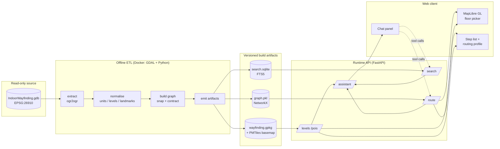
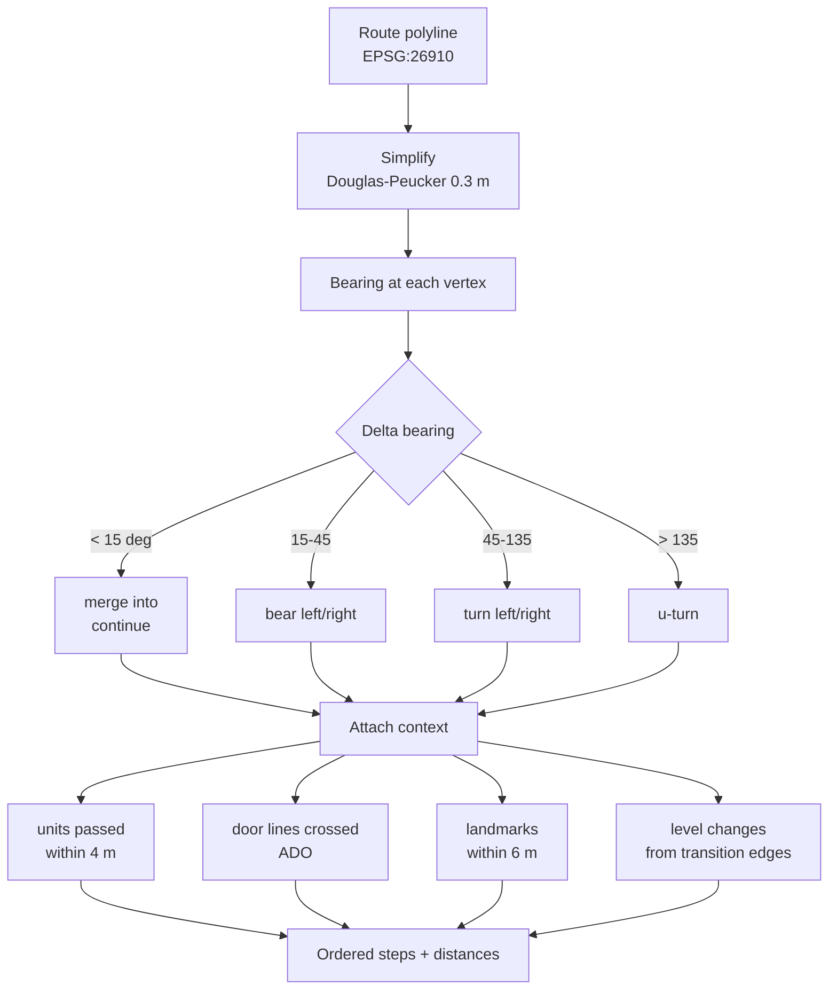
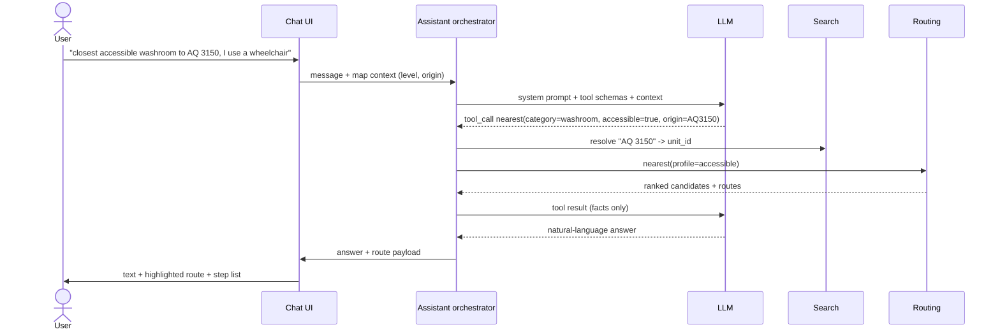

# System Design — AI-Assisted Indoor Navigation

A Google-Maps-style indoor wayfinding system for SFU Burnaby AQ / SH / ECC, comparable to
[SFU Room Finder](https://roomfinder.sfu.ca/apps/sfuroomfinder_web/) but adding turn-by-turn
guidance, an elevator-only routing profile, and a natural-language assistant.

This document separates the implemented bounded demo from the longer-term product
design. The current runtime is a standard-library Python HTTP service with an SVG /
JavaScript client and deterministic assistant. FastAPI, MapLibre, PMTiles, FTS5,
LLM orchestration and travel-time profiles below are future architecture, not
deployed capabilities. Accepted ADRs and [HANDOFF](HANDOFF.md) govern current behavior.
Neither the three-building inventory nor visible geometry establishes connected
routes or verified accessibility.

The phased navigation overhaul is [DT-024](plans/DT-024.md), governed by
[ADR-0017](adr/0017-navigation-state-and-journey.md) and motivated by the
[navigation review](reports/NAVIGATION-REVIEW.md). It changes client interaction and
state ownership. Stage A/B implements exact floor identity and asynchronous
navigation ownership; [delivery evidence](reports/DT-024-PHASE-AB.md) records its
verification. Endpoint drafts and synchronized journeys remain pending.

Read [01-data-findings.md](01-data-findings.md) first — every decision below traces back to a
specific property of the source geodatabase.

---

## 1. Goals and non-goals

**Goals**

- Discover recorded rooms, amenities and buildings across the three-building pilot and
  11 levels; offer routes only where the admitted graph supports the selected endpoints.
- Multi-floor routing with explicit **Stairs or elevators** and **Elevator only**
  profiles. Elevator-only excludes stairs; door access and wheelchair suitability remain unverified.
- Google-Maps-style **turn-by-turn** step list synchronised with a 2D floor-plan map and a floor picker.
- A natural-language assistant ("where's the closest accessible washroom to AQ 3150?") that is *grounded* in the routing engine, not in model recall.
- Fully reproducible ETL from the read-only geodatabase; the source data is never written to.

**Non-goals (v1)**

- Real-time blue-dot positioning — the data contains no beacon/Wi-Fi/QR anchors (gap **G6**).
- Room booking, occupancy, or scheduling.
- 3D/AR rendering.
- Outdoor campus routing between distant buildings.

## 2. Architecture

### 2.1 Implemented runtime and planned navigation increment

Docker GDAL/Python ETL produces the dual-CRS GeoPackage and contracted NetworkX
MultiDiGraph. The artifact-only HTTP service loads trusted, hash-checked artifacts
and exposes `/demo/v1` campus, facility, level, scene, unit, route-options, route and
deterministic assistant endpoints. The SVG client renders native EPSG:26910 geometry
in scene-local coordinates. Runtime services cannot access the raw source bind.

DT-024 retains these endpoints, accepted artifacts and routing/guidance contracts.
Section 9.2 describes its planned client architecture. Source reconciliation,
experimental topology promotion and verified outdoor routing remain separate work.

### 2.2 Longer-term product architecture



**Key architectural rule: the LLM never computes geometry.** It selects and parameterises calls to
deterministic services, then narrates their output. Determinism preserves the evidence
boundary; it does not establish accessibility or source correctness.

## 3. ETL pipeline

Runs in a container (GDAL + Python) with the data directory mounted **read-only**. Output goes only
to this repo's `build/` directory.

### 3.1 Extract

`ogr2ogr` each layer from the FileGDB into a working GeoPackage. Keep native **EPSG:26910** for all
metric computation (lengths, bearings, snapping); reproject a display copy to **EPSG:4326** for the
web client. Never compute distance in 4326.

### 3.2 Normalise

| Output table | Derivation |
| --- | --- |
| `facility` | `Facilities` → `facility_id, code (NAME), name (NAME_LONG), geom` |
| `level` | `Levels` → `level_id, facility_id, short_name, vertical_order, geom`; **`vertical_order` is the cross-building floor key** |
| `unit` | `Units` where `SEARCHABLE='Y'` → `unit_id, room_id, level_id, use_type, category, centroid, geom` |
| `landmark` | `Landmarks` → parse category from `DESCRIPTION` regex, then dedupe on `(category, level_id, 0.5 m cluster)` (gap **G7**) |
| `detail` | `Details` → basemap only; split `ADO` (doors) into its own table for instruction hints |

`unit.category` is a controlled vocabulary mapped from the 39 free-text `USE_TYPE` values, e.g.

```
"Washroom, single-stall, accessible"  -> washroom      + accessible=true
"Washroom, men's, accessible"         -> washroom      + accessible=true, gender=men
"Classroom" / "Meeting Room"          -> bookable_space
"Office"                              -> office
"Stairs" / "Elevator Shaft"           -> vertical_circulation   (excluded from search results)
```

The mapping lives in a checked-in YAML file, not in code, so facilities staff can extend it.

### 3.3 Graph construction

This is the core of the ETL and the step the data most requires (mean segment length 0.94 m).

1. **Node authored vertices.** Before snapping, split single-part pathways at exact
   same-level XYZ vertices shared with another pathway or recorded transition endpoint.
   Preserve source spans and authoritative length; reject ambiguous snap-cell collisions.
   Do not join nearby coordinates or interpolate geometric crossings. Then round every
   pathway/transition endpoint to a 1 cm grid in (x, y, `vertical_order`).
   Z alone is unreliable for identity; `vertical_order` is the authoritative level discriminator.
   Node IDs are the snapped coordinate tuples themselves (deterministic, stable, self-documenting —
   see ADR-0004).
2. **Build the raw graph.** NetworkX `MultiDiGraph` with bidirectional edges (two directed arcs per
   feature) — justified because `TRAVEL_DIRECTION = 1` for *all* 22,426 pathways and all 63
   transitions. Weight = `LENGTH_3D` (100% populated). Multi-directed representation supports future
   one-way features and allows parallel edges before contraction (ADR-0004).
3. **Add transition edges.** `Transitions` connect nodes across `VERTICAL_ORDER_FROM/TO`, tagged
   `mode = stairs | elevator` from `TRANSITION_TYPE` (2 / 4).
4. **Contract degree-2 chains.** Collapse runs of degree-2 nodes into a single edge carrying the full
  polyline. The measured topology-preserving result is 7,450 nodes and 19,884 directed arcs
  (9,942 physical edges): 19,758 pathway arcs (9,879 physical pathway edges) plus 126 unchanged
  transition arcs (63 physical transitions). This is a 55.92% pathway-arc reduction, with a mean
  pathway arc length of 2.13 m. The 5,501 protected nodes include physical pathway junctions,
  transition endpoints and mode boundaries, and 1,817 same-level nodes within 0.5 m of searchable
  unit centroids for destination attachment. These protections explain why the earlier “low
  thousands” estimate is unattainable without weakening topology or destination attachment
  invariants; compression is a measured graph characteristic, not a target that permits required
  nodes to be removed.
5. **Connect destinations.** For each `unit`, project its centroid to the nearest pathway node on the
   same `level_id` and add a zero-cost connector edge. Record the connector so instructions can say
  "AQ 3150 is on your left". This remains the future product invariant. The bounded DT-014 PoC uses
  ADR-0008 non-traversal approximate room anchors instead: it adds no connector geometry or graph
  edges, does not treat the room-to-anchor segment as traversable, and does not claim full product
  compliance.
6. **Validate.** Report edge-induced connected components per profile: count only nodes incident to
  an allowed edge. The measured pathway baseline is 855 components; contraction preserves the
  DT-006 profile counts exactly: 816 for the default profile and 840 for the elevator-only,
  stairs-excluded profile. On the pinned fixture, all 20 deterministic shortest-path comparisons
  are exact (maximum distance delta 0.0 m). Reject regressions and no-op transition modes, but do not
  require global connectivity. A query-time catalog gives every endpoint a profile-scoped
  `reachability_id` and `reachability_kind`; its counted `component_id` is null when the anchor is
  isolated under that profile. Prechecks compare reachability IDs. The same isolated anchor permits
  a zero-edge route, while distinct identities return a profile-specific `409` without search.
  Accepted-artifact evidence publishes a deterministic isolated-node inventory and count per
  profile and the count of eligible searchable unit endpoints anchored to those nodes. The accepted
  DT-014 artifacts have three `elevator_only` isolated graph nodes and zero such endpoint anchors,
  so an isolated same-anchor artifact fixture is required only if actual eligible endpoints exist;
  synthetic unit tests retain zero-edge semantic coverage. IDs and evidence use canonical RFC 8785
  JSON and SHA-256 as defined by
  [ADR-0009](adr/0009-edge-induced-profile-components-and-endpoint-reachability.md). Topology repair
  uses the exact authored-vertex default in [ADR-0018](adr/0018-exact-source-topology-default.md);
  historical accepted-artifact component counts remain evidence for the endpoint-only graph.
  Elevator-only, stairs-excluded routing is not wheelchair certification
  ([ADR-0005](adr/0005-measured-connectivity-baseline-and-validation-gates.md)).

Artifacts: `graph.pkl` (NetworkX), `wayfinding.gpkg`, `search.sqlite`, `basemap.pmtiles`, and a
`build-report.json` with all validation counts.

### 3.4 Reproducibility

The ETL is deterministic and re-runnable in the digest-pinned build image defined by ADR-0006. Gate
and ETL targets install nothing at runtime. Compose separates the source-capable extraction service,
which mounts the GDB read-only, from artifact-only transforms such as DT-007 contraction, which have
no source GDB mount.

Each intermediate stats sidecar records repository-relative paths and SHA-256 hashes for its
immediate input and output artifacts. It does not copy or recompute the source GDB hash. DT-009
verifies that chain and emits the authoritative `docs/reports/build-report.json`, containing the
deterministic source-GDB directory hash, ETL and image versions, final artifact hashes, and validation
counts. This preserves source-to-route traceability without giving downstream transforms source-data
access. Generated binary and working artifacts remain ignored under `build/`; only ticket-required,
reviewable reports are committed under `docs/reports/`.

## 4. Routing

### 4.1 Cost model

The following time-based model is a future proposal. Current demo routes minimize
recorded `length_3d` and expose `default` and `elevator_only`; they do not estimate
travel time or offer `fewest_transfers`.

```
edge_cost = length_3d / speed(profile, mode) + penalty(profile, mode)
```

| Profile | Allowed transition modes | Speed | Penalties |
| --- | --- | --- | --- |
| `default` | stairs, elevator | 1.35 m/s walk | stairs +2 s/level, elevator +45 s wait |
| `elevator_only` | **elevator only**, accessibility unverified | 1.0 m/s | elevator +45 s wait |
| `fewest_transfers` | stairs, elevator | 1.35 m/s | +120 s per level change |

`DELAY` is ignored — it is 99.5 % null (gap **G4**). The elevator wait is a configuration constant,
not a data value, and is documented as such in the API response.

### 4.2 Elevator-only mode — exactly what it does and does not claim

The dataset has **no** path-level accessibility attributes (gap **G1**), no ramps and no escalators
(gap **G2**). The current elevator-only profile applies this rule:

> **Filter out every edge with `mode = stairs`.** Route only over pathways and
> `TRANSITION_TYPE = 4` (Elevator / Wheelchair Lift) edges.

The UI and response warnings retain unverified door width, path width, slope,
powered doors and surface. Excluding stairs does not justify `step_free: true` or
an accessible-route claim. Current routing returns `409 no_elevator_only_route`
for disconnected elevator-only endpoints, without silently using stairs. It does
not supply a nearest usable elevator or prove physical traversal to room anchors.

### 4.3 Algorithm

The following A* speed heuristic and performance expectation belong to the future
time-based proposal, not a measurement or guarantee for the current demo.

Bidirectional A* over the contracted graph, with a heuristic of 3D Euclidean distance divided by
profile speed (admissible). At this graph size a route is a sub-millisecond operation; the graph is
loaded once at process start.

## 5. Turn-by-turn instruction generation

Current structured guidance follows [ADR-0012](adr/0012-route-guidance-and-floor-preview.md):
exact directed spans, chronological visits, paired transition phases and explicit
available/limited/unavailable outcomes. No simplification, invented context or
unverified building crossing is admitted. The diagram and contextual instruction
enrichment below remain future proposals requiring source evidence and contract review.

The data carries no instruction hints, so steps are derived geometrically from the contracted route
polyline.



Step types: `depart`, `continue`, `turn`, `enter_transition`, `exit_transition`, `enter_facility`,
`arrive`.

Consecutive `continue` steps are merged; steps under 3 m are absorbed into their neighbour. Without
this, the sub-metre segment geometry would generate thousands of useless steps.

Transitions produce a paired instruction, which is where the accessible mode becomes visible to the
user:

```
Take the elevator up to the 3000 Level (Academic Quadrangle).
Exit the elevator and turn right.
```

Cross-building steps are emitted whenever `facility_id` changes along the route
("Continue into Strand Hall"), because the three buildings are physically connected.

Each step carries `{ text, distance_m, level_id, vertical_order, geometry, modifier, icon }` so the
map can highlight the active segment and auto-switch floors as the user advances the step list.

Instruction text is generated by **templates, not by the LLM** — deterministic, testable, and
localisable. The LLM only rephrases when the user asks for a summary.

## 6. Search

SQLite FTS5 over `SEARCHABLE = 'Y'` units plus landmarks and facilities.

Indexed terms per unit: `ROOM_ID` (`AQ3150`), building code + number (`AQ 3150`), `NAME`,
`USE_TYPE`, mapped category, level short name, facility name. Ranking blends BM25 with a proximity
boost when the caller supplies an origin.

Category queries ("accessible washroom", "vending machine") resolve against `unit.category` /
`landmark.category` rather than free text, then rank by network distance from the origin — a routed
distance, not straight-line, since two rooms 5 m apart across a wall can be 100 m apart on foot.

## 7. API surface

This is the future `/v1` API proposal. Current `/demo/v1` contracts do not accept
arbitrary XY or QR origins, estimate times, expose tile services or implement nearest-place routing.

```
GET  /v1/facilities
GET  /v1/levels?facility_id=&vertical_order=
GET  /v1/search?q=&origin=&limit=&accessible=
GET  /v1/units/{unit_id}
GET  /v1/pois?category=&level_id=
POST /v1/route      { origin, destination, profile, options }
POST /v1/nearest    { origin, category, profile, limit }
POST /v1/assistant  { message, session_id, context }
GET  /v1/tiles/{z}/{x}/{y}.pbf
GET  /v1/health     { gdb_hash, etl_version, graph_stats }
```

`origin` / `destination` accept `{unit_id}`, `{level_id, x, y}`, or `{qr_anchor_id}` — the last one
is the forward-compatible hook for positioning (gap **G6**).

`/v1/route` response:

```json
{
  "profile": "elevator_only",
  "total_distance_m": 214.7,
  "estimated_seconds": 260,
  "levels_traversed": [{"level_id": "SFU_BURNABY_QUAD_3000", "vertical_order": 0}, ...],
  "geometry": { "type": "FeatureCollection", "features": [ ... per-level LineStrings ... ] },
  "steps": [ ... ],
  "accessibility": { ... },
  "warnings": []
}
```

Geometry is split per level so the client can render only the active floor.

## 8. AI assistant

This section proposes a future LLM orchestrator. Today's assistant is deterministic;
mobility requests use the unverified elevator-only profile. Any future verified
accessibility profile requires additional source evidence and a separate decision.

A tool-calling loop with a strict boundary: the model plans, the engine computes.



**Tools exposed to the model:** `search_places`, `get_place`, `find_nearest`, `plan_route`,
`describe_route`, `list_levels`. Each is a thin wrapper over the same code paths the REST API uses.

**Guardrails**

- The model may not emit coordinates, distances, times, or step text of its own; those fields are
  substituted from tool output before rendering.
- Any mobility phrasing ("wheelchair", "step-free", "can't do stairs", "crutches", "stroller") forces
  `profile=accessible` in the orchestrator, independent of what the model decides.
- If a tool returns "no step-free route", the model must surface that verbatim; it may not suggest a
  stairs alternative unless the user explicitly relaxes the constraint.
- Answers about anything outside the indexed dataset return "I don't have that in the floor plan
  data" rather than a guess. The three buildings are a small world and hallucination risk is high.
- Every assistant reply is traceable to the tool calls that produced it, logged for evaluation.

**Grounding, not RAG-over-documents.** The corpus is 1,210 rooms and 41 landmarks — structured, small
and exact. Vector search would add fuzziness where FTS5 plus category mapping is precise. Embeddings
are reserved for one narrow job: mapping colloquial phrasing ("the big lecture hall") onto the
controlled category vocabulary.

## 9. Web client

### 9.1 Longer-term MapLibre proposal

The following renderer and sharing features are future work. Its earlier combined
global-floor interaction is superseded for DT-024 by section 9.2: `vertical_order`
remains an internal alignment key, while a displayed floor uses its exact `level_id`.

- **MapLibre GL JS** rendering PMTiles: `Details` linework as the floor plan, `Units` as fills,
  `Levels` as the plate outline.
- **Building-scoped floor picker keyed on exact `level_id`**; global `vertical_order`
  supports internal alignment without merging building-specific floor choices.
- Route rendered per level: active level solid, other levels dimmed, transition points badged with
  stairs/elevator icons.
- **Routing profile** in endpoint editing, always validated server-side. Elevator-only
  excludes stairs without asserting accessible traversal.
- Step list synced to the map; selecting a step pans the map and switches the floor.
- Deep links: `/route?from=AQ3150&to=SH227&accessible=1` for sharing and for QR posters.
- Accessibility of the UI itself: WCAG 2.2 AA, full keyboard navigation, screen-reader-friendly step
  list (each step an `aria-live` region during guidance), and a text-only route view that works
  without the map.

### 9.2 DT-024 navigation state and journey

Stage B implements context, facility, requested/displayed floor, room and request
revisions in the existing client. Its pending route step commits only after scene
success; route replacement cancels route-owned scene work while Clear preserves
independent floor browsing. Scene loading/errors retain priority over room status.
The remaining draft/commit, journey, cache and responsive requirements below are
the C/D contract, not a claim that the first increment implements them.

The post-PR #4 usability follow-up exposes persistent building/floor buttons and
a filterable room list. Primary building actions open a recorded floor directly;
secondary dropdowns and search forms expand on demand. Compact map tools reduce
initial scrolling without changing scene data or route behavior. See the
[follow-up report](reports/DT-024-COMPACT.md) for current verification.

One explicit state model owns context (Campus, Building, Floor exploration or Route),
inspected facility, requested and displayed exact floor IDs, scene status, inspected
room, route draft, committed route/request key, selected visit/step, following versus
exploration mode and per-floor camera state. DOM controls are derived views, never
the source of navigation truth. User actions pass through a small transition layer.

All recorded buildings stay selectable. Floor choices belong only to the selected
building; changing a floor never substitutes another building. Building selection
uses a valid recorded floor without claiming an entrance or connection. An explicit
Open floor action works even when that floor is already selected. While a scene
loads, requested and displayed floors are separately labeled; failure retains the
correctly labeled last good map and offers Retry.

Accessible searchable From/To comboboxes show exact room identity, building and
floor, with optional building/floor filters. Connected destinations are prioritized;
disconnected, same-anchor, endpoint-unavailable, pending and failed availability
remain distinct. Availability is graph reachability, not guidance certification.
Endpoint/profile changes and Swap edit a draft. Preview route explicitly submits
that draft once. The committed route remains labeled with its own endpoints/profile
while edits are pending or a replacement fails; a new elevator-only draft cannot
relabel an old stairs route. Room inspection never clears the route; Start here and
Directions here explicitly edit the draft. Clear route preserves inspection and camera.

The journey renders the API's ordered visits, including repeated visits to one floor,
and explicit stairs/elevator transitions. Selecting a visit chooses its first
instruction and synchronizes map, visit, instruction and Next/Previous. Transition
departure and arrival retain their exact floor/marker references; express elevators
do not acquire invented intermediate stops. Manual floor exploration exposes an
Exploring / Return to route strip and replaces route Next/Previous with Return to
route, preventing movement relative to a hidden selection. Current instruction and
transition actions stay beside the map on desktop and in a persistent instruction
panel on mobile; the full journey can expand without hiding the primary controls.

Every async completion must match its resource key and current user intent. Abort
obsolete requests and still guard results; cancellation alone is insufficient. A late
route may be stored without navigating away from a newer deliberate floor choice.
Room details cannot overwrite another selection or floor status. Deduplicate scene
loads and cache by artifact identity plus exact level ID; lazily preload adjacent
route visits only after the active scene settles. Measure transfer, JSON parsing and
SVG rendering separately before considering compression or precomputation. Preserve
exact route coordinates, selected spans and available/limited/unavailable guidance.

Acceptance requires real pointer and keyboard journeys across all 11 floors and
every building, opening an already-selected floor, room search/filter/Swap/commit,
inspection without route loss, draft failure and Clear. Assert displayed building,
floor, route identity and instruction together through all visits and transition
phases, express and repeated-floor cases, exploration/return and slow/out-of-order
scene, room, availability and route responses. Include scene failure/retry, limited
stairs guidance, available elevator guidance, disconnected, same-anchor and unavailable
endpoints. Exercise desktop, 390px and 320px layouts, focus and announcements without
programmatically opening hidden panels or bypassing endpoint entry. Delivery requires
RED evidence, fresh Docker gates and assembled-app browser/API E2E; documentation
approval does not establish implementation completion or source/topology approval.

### 9.3 Bounded stakeholder demo exception

DT-015 does not promote the temporary `/demo/v1` SVG explorer to the production web architecture.
For an attended demonstration on a trusted private LAN, ADR-0010 permits only the demo port to be
published on all host interfaces, with an explicit no-auth/plain-HTTP warning, Host validation,
bounded requests and logs, read-only artifacts, no external assets, and configurable loopback
rollback. This exception does not authorize internet, open campus, guest-network, or persistent
deployment.

The demo's manual form, two-room activation, and exact deterministic chat directions make one
unchanged `POST /demo/v1/route` request and share one response renderer. The browser and assistant
do not compute routing, distance, reachability, instructions, geometry, or accessibility. The map
draws only returned per-level graph geometry; approximate room-anchor segments remain unrepresented.
`elevator_only` continues to mean elevators only and stairs excluded, with `door_width`,
`path_width`, `slope`, `powered_doors`, and `surface` unverified on success and failure.

## 10. Validation and evaluation

The table below describes longer-term product evaluation. Current delivery follows
the accepted demo contracts and DT-024 acceptance above; elevator-only tests assert
stairs exclusion without certifying accessibility. All verification executes in Docker.

| Layer | Tests |
| --- | --- |
| ETL | Feature counts match the profile; measured component counts do not regress; no orphan units; `vertical_order` mapping matches `docs/01-data-findings.md` §3; artifact lineage hashes verify |
| Routing | Golden route fixtures (same-level, cross-level, cross-building) with expected distance tolerances |
| Accessibility | **Invariant: no route with `profile=accessible` may contain an edge with `mode=stairs`.** Property-tested across a large sample of origin/destination pairs |
| Instructions | Snapshot tests on step text; assert no route emits more than ~1 step per 8 m of path |
| Assistant | Scripted conversation suite scoring tool-selection accuracy and refusal behaviour; a mobility-phrasing suite asserting `profile=accessible` is always forced |

All tests run in the same container as the ETL.

## 11. Delivery phases

| Phase | Deliverable |
| --- | --- |
| 0 | ✅ Data profiling and this design (`tools/`, `docs/`) |
| 1 | ETL → GeoPackage + contracted graph + build report |
| 2 | Routing core: profiles, A*, accessible invariant tests |
| 3 | Turn-by-turn instruction generator |
| 4 | FastAPI service + search index + tiles |
| 5 | Future MapLibre web client with building-scoped floors and routing profiles |
| 6 | Assistant orchestrator, tool schemas, guardrails, eval suite |
| 7 | QR anchor origins; hooks for a future positioning provider |

## 12. Open questions for stakeholders

1. Can Facilities supply a **closures / after-hours restrictions feed**? Without it the router can
   direct users through locked doors (gap **G9**).
2. Is an **accessibility survey** (door widths, powered doors, elevator dimensions) feasible? It is
   the single highest-value data addition and would let the accessible profile make real claims
   instead of a stairs-exclusion claim (gaps **G1**, **G3**).
3. Are **elevator outage** notifications available? With only 21 elevator transitions, one outage can
   sever step-free connectivity entirely.
4. Will more buildings be delivered as AIIM extracts in the same schema? The ETL assumes yes (gap **G8**).
5. Is there an authoritative **room-name/alias** source (department names, "Halpern Centre") to enrich
   the search index beyond `ROOM_ID`?
6. What are the acceptable elevator-wait and walking-speed constants for the accessible profile?
