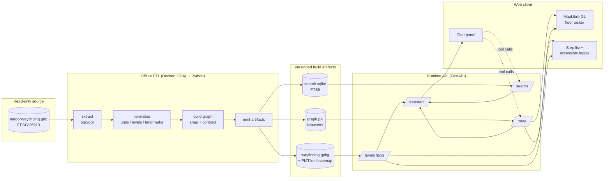
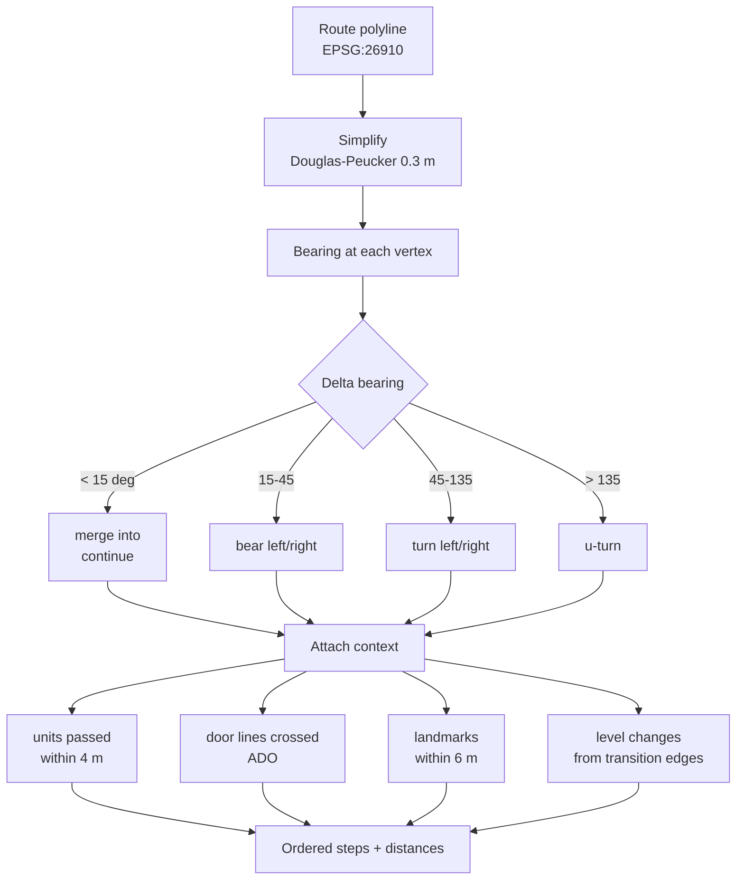
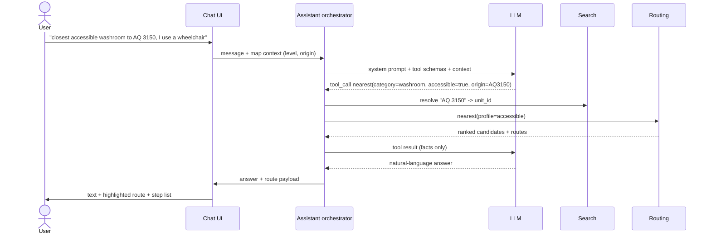

# System Design — AI-Assisted Indoor Navigation

A Google-Maps-style indoor wayfinding system for SFU Burnaby AQ / SH / ECC, comparable to
[SFU Room Finder](https://roomfinder.sfu.ca/apps/sfuroomfinder_web/) but adding turn-by-turn
guidance, an accessible-route mode, and a natural-language assistant.

Read [01-data-findings.md](01-data-findings.md) first — every decision below traces back to a
specific property of the source geodatabase.

---

## 1. Goals and non-goals

**Goals**

- Search for any room, amenity, or building and route to it across three connected buildings and 11 levels.
- Multi-floor routing with an explicit **accessible** toggle (step-free / elevators only).
- Google-Maps-style **turn-by-turn** step list synchronised with a 2D floor-plan map and a floor picker.
- A natural-language assistant ("where's the closest accessible washroom to AQ 3150?") that is *grounded* in the routing engine, not in model recall.
- Fully reproducible ETL from the read-only geodatabase; the source data is never written to.

**Non-goals (v1)**

- Real-time blue-dot positioning — the data contains no beacon/Wi-Fi/QR anchors (gap **G6**).
- Room booking, occupancy, or scheduling.
- 3D/AR rendering.
- Outdoor campus routing between distant buildings.

## 2. Architecture



**Key architectural rule: the LLM never computes geometry.** It selects and parameterises calls to
deterministic services, then narrates their output. This is what makes accessibility claims and
distances trustworthy.

## 3. ETL pipeline

Runs in a container (GDAL + Python) with the data directory mounted **read-only**. Output goes only
to this repo's `build/` directory.

### 3.1 Extract

`ogr2ogr` each layer from the FileGDB into a working GeoPackage. Keep native **EPSG:26910** for all
metric computation (lengths, bearings, snapping); reproject a display copy to **EPSG:4326** for the
web client. Never compute distance in 4326.

### 3.2 Normalise

| Output table | Derivation |
| --- | --- |
| `facility` | `Facilities` → `facility_id, code (NAME), name (NAME_LONG), geom` |
| `level` | `Levels` → `level_id, facility_id, short_name, vertical_order, geom`; **`vertical_order` is the cross-building floor key** |
| `unit` | `Units` where `SEARCHABLE='Y'` → `unit_id, room_id, level_id, use_type, category, centroid, geom` |
| `landmark` | `Landmarks` → parse category from `DESCRIPTION` regex, then dedupe on `(category, level_id, 0.5 m cluster)` (gap **G7**) |
| `detail` | `Details` → basemap only; split `ADO` (doors) into its own table for instruction hints |

`unit.category` is a controlled vocabulary mapped from the 39 free-text `USE_TYPE` values, e.g.

```
"Washroom, single-stall, accessible"  -> washroom      + accessible=true
"Washroom, men's, accessible"         -> washroom      + accessible=true, gender=men
"Classroom" / "Meeting Room"          -> bookable_space
"Office"                              -> office
"Stairs" / "Elevator Shaft"           -> vertical_circulation   (excluded from search results)
```

The mapping lives in a checked-in YAML file, not in code, so facilities staff can extend it.

### 3.3 Graph construction

This is the core of the ETL and the step the data most requires (mean segment length 0.94 m).

1. **Snap nodes.** Round every pathway/transition endpoint to a 1 cm grid in (x, y, `vertical_order`).
   Z alone is unreliable for identity; `vertical_order` is the authoritative level discriminator.
   Node IDs are the snapped coordinate tuples themselves (deterministic, stable, self-documenting —
   see ADR-0004).
2. **Build the raw graph.** NetworkX `MultiDiGraph` with bidirectional edges (two directed arcs per
   feature) — justified because `TRAVEL_DIRECTION = 1` for *all* 22,426 pathways and all 63
   transitions. Weight = `LENGTH_3D` (100% populated). Multi-directed representation supports future
   one-way features and allows parallel edges before contraction (ADR-0004).
3. **Add transition edges.** `Transitions` connect nodes across `VERTICAL_ORDER_FROM/TO`, tagged
   `mode = stairs | elevator` from `TRANSITION_TYPE` (2 / 4).
4. **Contract degree-2 chains.** Collapse runs of degree-2 nodes into a single edge carrying the full
   polyline. Expected reduction from ~22k edges to low thousands. Junctions, transition endpoints and
   unit-entrance connectors are protected from contraction.
5. **Connect destinations.** For each `unit`, project its centroid to the nearest pathway node on the
   same `level_id` and add a zero-cost connector edge. Record the connector so instructions can say
   "AQ 3150 is on your left".
6. **Validate.** Report connected components per profile. A component count > 1 for the walking
   profile is a hard build failure; for the accessible profile it is a warning plus an explicit
   reachability matrix (gap **G2**).

Artifacts: `graph.pkl` (NetworkX), `wayfinding.gpkg`, `search.sqlite`, `basemap.pmtiles`, and a
`build-report.json` with all validation counts.

### 3.4 Reproducibility

The ETL is a single container invocation, deterministic, and re-runnable. Every artifact carries the
source GDB hash and the ETL version so a route can always be traced to the data that produced it.

## 4. Routing

### 4.1 Cost model

```
edge_cost = length_3d / speed(profile, mode) + penalty(profile, mode)
```

| Profile | Allowed transition modes | Speed | Penalties |
| --- | --- | --- | --- |
| `default` | stairs, elevator | 1.35 m/s walk | stairs +2 s/level, elevator +45 s wait |
| `accessible` | **elevator only** | 1.0 m/s | elevator +45 s wait |
| `fewest_transfers` | stairs, elevator | 1.35 m/s | +120 s per level change |

`DELAY` is ignored — it is 99.5 % null (gap **G4**). The elevator wait is a configuration constant,
not a data value, and is documented as such in the API response.

### 4.2 Accessible mode — exactly what it does and does not claim

The dataset has **no** path-level accessibility attributes (gap **G1**), no ramps and no escalators
(gap **G2**). So the accessible profile is implemented as a single, honest rule:

> **Filter out every edge with `mode = stairs`.** Route only over pathways and
> `TRANSITION_TYPE = 4` (Elevator / Wheelchair Lift) edges.

The API returns this contract explicitly so the UI can state it plainly rather than implying a
certified accessible route:

```json
"accessibility": {
  "step_free": true,
  "basis": "TRANSITION_TYPE=4 (elevator) only; TRANSITION_TYPE=2 (stairs) excluded",
  "not_verified": ["door_width", "path_width", "slope", "powered_doors", "surface"]
}
```

If no step-free path exists, the API returns `409` with the reachable levels and the nearest elevator
— never a silent fallback to stairs. This failure mode is realistic: 21 elevator transitions across
11 levels is thin coverage.

### 4.3 Algorithm

Bidirectional A* over the contracted graph, with a heuristic of 3D Euclidean distance divided by
profile speed (admissible). At this graph size a route is a sub-millisecond operation; the graph is
loaded once at process start.

## 5. Turn-by-turn instruction generation

The data carries no instruction hints, so steps are derived geometrically from the contracted route
polyline.



Step types: `depart`, `continue`, `turn`, `enter_transition`, `exit_transition`, `enter_facility`,
`arrive`.

Consecutive `continue` steps are merged; steps under 3 m are absorbed into their neighbour. Without
this, the sub-metre segment geometry would generate thousands of useless steps.

Transitions produce a paired instruction, which is where the accessible mode becomes visible to the
user:

```
Take the elevator up to the 3000 Level (Academic Quadrangle).
Exit the elevator and turn right.
```

Cross-building steps are emitted whenever `facility_id` changes along the route
("Continue into Strand Hall"), because the three buildings are physically connected.

Each step carries `{ text, distance_m, level_id, vertical_order, geometry, modifier, icon }` so the
map can highlight the active segment and auto-switch floors as the user advances the step list.

Instruction text is generated by **templates, not by the LLM** — deterministic, testable, and
localisable. The LLM only rephrases when the user asks for a summary.

## 6. Search

SQLite FTS5 over `SEARCHABLE = 'Y'` units plus landmarks and facilities.

Indexed terms per unit: `ROOM_ID` (`AQ3150`), building code + number (`AQ 3150`), `NAME`,
`USE_TYPE`, mapped category, level short name, facility name. Ranking blends BM25 with a proximity
boost when the caller supplies an origin.

Category queries ("accessible washroom", "vending machine") resolve against `unit.category` /
`landmark.category` rather than free text, then rank by network distance from the origin — a routed
distance, not straight-line, since two rooms 5 m apart across a wall can be 100 m apart on foot.

## 7. API surface

```
GET  /v1/facilities
GET  /v1/levels?facility_id=&vertical_order=
GET  /v1/search?q=&origin=&limit=&accessible=
GET  /v1/units/{unit_id}
GET  /v1/pois?category=&level_id=
POST /v1/route      { origin, destination, profile, options }
POST /v1/nearest    { origin, category, profile, limit }
POST /v1/assistant  { message, session_id, context }
GET  /v1/tiles/{z}/{x}/{y}.pbf
GET  /v1/health     { gdb_hash, etl_version, graph_stats }
```

`origin` / `destination` accept `{unit_id}`, `{level_id, x, y}`, or `{qr_anchor_id}` — the last one
is the forward-compatible hook for positioning (gap **G6**).

`/v1/route` response:

```json
{
  "profile": "accessible",
  "total_distance_m": 214.7,
  "estimated_seconds": 260,
  "levels_traversed": [{"level_id": "SFU_BURNABY_QUAD_3000", "vertical_order": 0}, ...],
  "geometry": { "type": "FeatureCollection", "features": [ ... per-level LineStrings ... ] },
  "steps": [ ... ],
  "accessibility": { ... },
  "warnings": []
}
```

Geometry is split per level so the client can render only the active floor.

## 8. AI assistant

A tool-calling loop with a strict boundary: the model plans, the engine computes.



**Tools exposed to the model:** `search_places`, `get_place`, `find_nearest`, `plan_route`,
`describe_route`, `list_levels`. Each is a thin wrapper over the same code paths the REST API uses.

**Guardrails**

- The model may not emit coordinates, distances, times, or step text of its own; those fields are
  substituted from tool output before rendering.
- Any mobility phrasing ("wheelchair", "step-free", "can't do stairs", "crutches", "stroller") forces
  `profile=accessible` in the orchestrator, independent of what the model decides.
- If a tool returns "no step-free route", the model must surface that verbatim; it may not suggest a
  stairs alternative unless the user explicitly relaxes the constraint.
- Answers about anything outside the indexed dataset return "I don't have that in the floor plan
  data" rather than a guess. The three buildings are a small world and hallucination risk is high.
- Every assistant reply is traceable to the tool calls that produced it, logged for evaluation.

**Grounding, not RAG-over-documents.** The corpus is 1,210 rooms and 41 landmarks — structured, small
and exact. Vector search would add fuzziness where FTS5 plus category mapping is precise. Embeddings
are reserved for one narrow job: mapping colloquial phrasing ("the big lecture hall") onto the
controlled category vocabulary.

## 9. Web client

- **MapLibre GL JS** rendering PMTiles: `Details` linework as the floor plan, `Units` as fills,
  `Levels` as the plate outline.
- **Floor picker keyed on `vertical_order`**, so one control spans all three buildings and selecting
  "Level 0" reveals AQ 3000, SH 1000 and ECC 3000 together.
- Route rendered per level: active level solid, other levels dimmed, transition points badged with
  stairs/elevator icons.
- **Accessible toggle** in the search bar, persisted per session, and always re-run server-side — it
  is a routing parameter, not a display filter.
- Step list synced to the map; selecting a step pans the map and switches the floor.
- Deep links: `/route?from=AQ3150&to=SH227&accessible=1` for sharing and for QR posters.
- Accessibility of the UI itself: WCAG 2.2 AA, full keyboard navigation, screen-reader-friendly step
  list (each step an `aria-live` region during guidance), and a text-only route view that works
  without the map.

## 10. Validation and evaluation

| Layer | Tests |
| --- | --- |
| ETL | Feature counts match the profile; graph is connected for the default profile; no orphan units; `vertical_order` mapping matches `docs/01-data-findings.md` §3 |
| Routing | Golden route fixtures (same-level, cross-level, cross-building) with expected distance tolerances |
| Accessibility | **Invariant: no route with `profile=accessible` may contain an edge with `mode=stairs`.** Property-tested across a large sample of origin/destination pairs |
| Instructions | Snapshot tests on step text; assert no route emits more than ~1 step per 8 m of path |
| Assistant | Scripted conversation suite scoring tool-selection accuracy and refusal behaviour; a mobility-phrasing suite asserting `profile=accessible` is always forced |

All tests run in the same container as the ETL.

## 11. Delivery phases

| Phase | Deliverable |
| --- | --- |
| 0 | ✅ Data profiling and this design (`tools/`, `docs/`) |
| 1 | ETL → GeoPackage + contracted graph + build report |
| 2 | Routing core: profiles, A*, accessible invariant tests |
| 3 | Turn-by-turn instruction generator |
| 4 | FastAPI service + search index + tiles |
| 5 | MapLibre web client with floor picker and accessible toggle |
| 6 | Assistant orchestrator, tool schemas, guardrails, eval suite |
| 7 | QR anchor origins; hooks for a future positioning provider |

## 12. Open questions for stakeholders

1. Can Facilities supply a **closures / after-hours restrictions feed**? Without it the router can
   direct users through locked doors (gap **G9**).
2. Is an **accessibility survey** (door widths, powered doors, elevator dimensions) feasible? It is
   the single highest-value data addition and would let the accessible profile make real claims
   instead of a stairs-exclusion claim (gaps **G1**, **G3**).
3. Are **elevator outage** notifications available? With only 21 elevator transitions, one outage can
   sever step-free connectivity entirely.
4. Will more buildings be delivered as AIIM extracts in the same schema? The ETL assumes yes (gap **G8**).
5. Is there an authoritative **room-name/alias** source (department names, "Halpern Centre") to enrich
   the search index beyond `ROOM_ID`?
6. What are the acceptable elevator-wait and walking-speed constants for the accessible profile?
