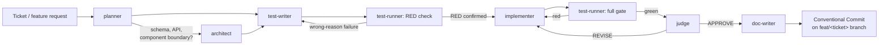

# Harness Design — AI-Assisted Delivery Pipeline

> Historical Copilot harness design. Current operating instructions are in
> [AGENTS.md](../AGENTS.md), with status in [HANDOFF.md](HANDOFF.md).
> The role pipeline below is optional; gates and final evidence govern completion.
> The PostToolUse hook is diagnostic and cannot prevent an already-completed write.

## Current collaboration policy

The harness defaults to concurrent bounded independent work under one accountable large-model lead.
The lead assigns each worker an explicit task scope, file ownership, dependency list, and evidence
to return. Suitable parallel tasks include separate modules, separate documentation files, and
read-only reviews. Workers must not edit the same file concurrently or begin work whose inputs are
still being changed; dependent work is handed off in order. Every worker reports commands, exit
codes, changed paths, test or gate results, skips, and limitations so the lead can reconcile the
results.

The lead keeps TDD dependencies sequential: planned failing tests and the RED check precede
implementation, implementation precedes full gates, and gates precede final review. Smaller
models handle simple mechanical edits, routine documentation, and established gate execution;
the large-model lead handles planning, orchestration, architecture, and integration. After
combining independent results, a large-model judge reviews the final combined diff and evidence.
All project execution, including tests, builds, data processing, and evidence or hash generation,
runs inside Docker. Host activity is limited to repository inspection/editing, Git and Docker CLI
operations, and thin launcher glue.

Current model allocation follows [AGENTS.md](../AGENTS.md): large models own planning,
orchestration, architecture and judging; smaller workers handle bounded, simpler work.
Escalate complex research, implementation, debugging, security and GIS decisions to
the large model rather than assigning by role name alone. Copilot model names below
retain existing provider identifiers and must be checked for availability when invoked.
Prompt-file model selection is a legacy Local-agent adapter; Agent Host does not load
prompt files ([VS Code documentation](https://code.visualstudio.com/docs/agent-customization/prompt-files)).

How this repo is (going to be) built, not what it builds. [01-data-findings.md](01-data-findings.md)
and [02-system-design.md](02-system-design.md) are the *product* design; this document is the
*process* design — the agent harness that will deliver phases 1–7 of
[§11 delivery phases](02-system-design.md#11-delivery-phases).

This is scaffolding only. **No product code is added by this document or the files it
introduces.** It defines the subagents, slash commands, instructions, and gates that will be used
once Phase 1 (ETL) starts.

## 1. Why a harness at all

Two prior implementations of this pattern exist and were used as reference (read-only, not
modified):

| Reference | What it is | What we take from it |
| --- | --- | --- |
| [`humanaxiom/jd-assistant`](https://github.com/humanaxiom/jd-assistant) | Claude Code harness for an unrelated SFU project (JD Bank). `harness-claude-code/.claude/` + `CLAUDE.md`. | The **planner → tester → coder(loop) → reviewer + security → docs** subagent pipeline; Docker-only gates (`make gates`); an orchestrator that hard-blocks on reviewer/security rejection; branch/commit discipline. |
| `C:\repos\sfudt\claude\dtwin-harness` | A Claude Code harness for a *different, broader* SFU digital-twin build (same AIIM data family, larger scope — full campus twin vs. this repo's 3-building indoor-wayfinding scope). `CLAUDE.md` + `.claude/agents`, `.claude/commands`. | The **planner → architect → test-writer → test-runner → implementer → judge → doc-writer** pipeline (TDD-first, judge-gated); the "no action outside the repo" prime directive; per-package coverage floors; ADR-driven schema/API changes; a living `docs/HANDOFF.md`. |

Both converge on the same shape: **a fixed pipeline of narrow, single-role subagents, a
deterministic gate that blocks merges, and zero throwaway ad-hoc commands** — every state-changing
action is a checked-in script. That shape is what we are porting here, adapted from Claude
Code's `.claude/agents` + `.claude/commands` + `CLAUDE.md` to VS Code's native GitHub Copilot
customization primitives.

## 2. Primitive mapping (Claude Code → GitHub Copilot / VS Code)

| Claude Code primitive | Purpose | GitHub Copilot equivalent |
| --- | --- | --- |
| `CLAUDE.md` | Always-on project rules | [`.github/copilot-instructions.md`](../.github/copilot-instructions.md) |
| `.claude/agents/<role>.md` (frontmatter: `name`, `description`, `tools`, `model`) | Single-role subagent | `.github/agents/<role>.agent.md` (same shape: `description`, `tools`, `model`) |
| `.claude/commands/<name>.md` (slash command, `$ARGUMENTS`) | Orchestrated multi-step workflow | `.github/prompts/<name>.prompt.md` (slash command, `${input}`) |
| `.claude/settings.json` `permissions.allow/deny` | Tool allow/deny list | Workspace `chat.tools` trust settings + per-agent `tools:` allow-list (scoped per role instead of one global list) |
| `.claude/settings.json` `hooks.PostToolUse` | Deterministic enforcement (e.g. quickcheck after Write/Edit) | `.github/hooks/*.json` (`PostToolUse`/`PreToolUse` command hooks) |
| `docs/adr/`, `docs/plans/`, `docs/DOD.md`, `docs/HANDOFF.md` | Living project memory | Same paths, same convention — process docs are portable as-is |
| `Makefile` wrapping `docker compose run --rm test ...` (dtwin-harness ADR-0003: no local code) | Reproducible, host-agnostic gates | Carried forward unchanged once Phase 1 lands: gates still run only in containers, never on the host (this repo's own tools already follow this — `tools/run_profile.ps1` runs GDAL in a container, never installs it) |

Two structural differences from the Claude Code setups, both deliberate:

1. **No separate orchestrator process.** `dtwin-harness`'s `/tdd-feature` command is text that
   *this* agent reads and follows by directly invoking subagents (the `agent` tool alias) — there is
   no `core/src/agents/orchestrator.py` equivalent to write and gate. The prompt file *is* the
   orchestrator.
2. **Judge is advisory until CI exists.** `jd-assistant`'s reviewer/security agents "hard-block" a
   pipeline that already has CI. Until Phase 4 or so there is no CI to hard-block; `judge` blocks
   *this agent* from declaring a ticket done, which is the enforceable equivalent available today.

## 3. Subagent pipeline

`data-qa` and `researcher` sit outside this main loop and are invoked ad hoc: `data-qa` whenever a
ticket touches spatial data or the routing graph (validates against the invariants and gaps
catalogued in [01-data-findings.md §8](01-data-findings.md#8-data-gaps-that-constrain-the-design));
`researcher` for read-only investigation (reading the source GDB, prior art, library docs) before a
plan is written.

| Role | File | Tools | Notes |
| --- | --- | --- | --- |
| `planner` | [`.github/agents/planner.agent.md`](../.github/agents/planner.agent.md) | read, search, edit, todo | Writes `docs/plans/<ticket>.md`; never touches `packages/`. |
| `architect` | [`.github/agents/architect.agent.md`](../.github/agents/architect.agent.md) | read, search, edit | Writes ADRs; invoked only when the plan changes schema/API/component boundaries. |
| `test-writer` | [`.github/agents/test-writer.agent.md`](../.github/agents/test-writer.agent.md) | read, search, edit | Writes failing tests only, from the plan's test list. |
| `test-runner` | [`.github/agents/test-runner.agent.md`](../.github/agents/test-runner.agent.md) | read, search, execute | Runs the container-only gate commands; never edits. |
| `implementer` | [`.github/agents/implementer.agent.md`](../.github/agents/implementer.agent.md) | read, search, edit, execute | Minimal code to green, one refactor pass. |
| `judge` | [`.github/agents/judge.agent.md`](../.github/agents/judge.agent.md) | read, search, execute | Read-only. `APPROVE`/`REVISE` against the plan + `docs/DOD.md`. |
| `doc-writer` | [`.github/agents/doc-writer.agent.md`](../.github/agents/doc-writer.agent.md) | read, search, edit | `CHANGELOG`, docstrings, README deltas, `docs/HANDOFF.md`. |
| `data-qa` | [`.github/agents/data-qa.agent.md`](../.github/agents/data-qa.agent.md) | read, search, execute | Graph connectivity / accessibility-invariant checks (§10 of the system design). |
| `researcher` | [`.github/agents/researcher.agent.md`](../.github/agents/researcher.agent.md) | read, search, web | Read-only; feeds `planner`, never writes plans or code itself. |

## 4. Slash commands (prompts)

| Command | File | Mirrors | Purpose |
| --- | --- | --- | --- |
| `/bootstrap` | [`.github/prompts/bootstrap.prompt.md`](../.github/prompts/bootstrap.prompt.md) | `dtwin-harness /bootstrap` | Clean-checkout to running stack, once Phase 1+ containers exist. |
| `/tdd-feature` | [`.github/prompts/tdd-feature.prompt.md`](../.github/prompts/tdd-feature.prompt.md) | `dtwin-harness /tdd-feature` | Runs the full pipeline in §3 for one ticket. |
| `/data-import` | [`.github/prompts/data-import.prompt.md`](../.github/prompts/data-import.prompt.md) | `dtwin-harness /data-import` | Re-run/extend the ETL against the read-only GDB; always through checked-in scripts. |
| `/demo` | [`.github/prompts/demo.prompt.md`](../.github/prompts/demo.prompt.md) | both references' demo scripts | Bring up the current phase's runnable slice for a stakeholder walkthrough. |
| `/retro` | [`.github/prompts/retro.prompt.md`](../.github/prompts/retro.prompt.md) | `dtwin-harness /retro` | Append a retro note after a ticket or phase closes. |
| `/sprint-plan` | [`.github/prompts/sprint-plan.prompt.md`](../.github/prompts/sprint-plan.prompt.md) | `dtwin-harness /sprint-plan` | Backlog decomposition across `docs/02-system-design.md §11` phases. |

## 5. Prime directives (carried into `.github/copilot-instructions.md`)

Ported from both references' `CLAUDE.md`, adapted to this repo's actual constraints:

1. **Write boundary is absolute.** Everything produced lives under `C:\repos\sfudt\ghcp`
   (already stated in [README.md](../README.md)); the source GDB and
   `C:\repos\sfudt\claude\dtwin-harness` are read-only and never modified by this harness.
2. **No local Python, ever** (user convention, this workspace) — every script that needs GDAL,
   Python, or a database runs inside a container, exactly as `tools/run_profile.ps1` already does.
   This generalises `dtwin-harness` ADR-0003 ("no local code") one step further.
3. **TDD is non-negotiable** once Phase 1 starts: no production code before a failing test;
   red → green → refactor; enforced by the `test-writer` → `test-runner` → `implementer` sequence.
4. **The LLM never computes geometry** (already a system-design invariant, [§2](02-system-design.md#2-architecture))
   — the harness invariant is the same rule one level up: `judge` and `data-qa` verify this by
   inspection, not by trusting the diff's own claims.
5. **Every state-changing action is a checked-in script**, never an ad hoc one-off — the same rule
   `tools/*.ps1` already follows for data profiling, extended to ETL, migrations, and fixture/golden
   capture once they exist.
6. **The judge gates "done."** No ticket is complete until `judge` records `APPROVE` against
   `docs/DOD.md`.

## 6. Gates (deferred to Phase 1, contract fixed now)

`docs/DOD.md` fixes the shape of the gate today so Phase 1's `Makefile`/`docker-compose` are written
against a known target instead of invented ad hoc: containerised `test` / `lint` / `type` / `dataqa`
targets, per-package coverage floors, and the accessibility-invariant test named explicitly in
[02-system-design.md §10](02-system-design.md#10-validation-and-evaluation) ("no route with
`profile=accessible` may contain an edge with `mode=stairs`"). Nothing under `infra/` or a
`Makefile` is added by this document — those are Phase 1 deliverables, built by `architect` +
`implementer` against this contract, not invented ahead of the code they gate.

## 7. What is and isn't in this change

**Added:** `.github/copilot-instructions.md`, `.github/agents/*.agent.md`, `.github/prompts/*.prompt.md`,
`.github/instructions/*.instructions.md`, `.github/hooks/*.json` (+ its script), `docs/DOD.md`,
`docs/HANDOFF.md`, `docs/SDLC.md`, `docs/ROADMAP.md`, `docs/adr/0001-record-architecture-decisions.md`,
empty-state placeholders for `docs/plans/`, `docs/retros/`, `docs/reports/`.

**Not added:** any `packages/`, `infra/`, ETL code, API code, web client, or database — Phase 1
onward, run through `/tdd-feature` once this harness is in place.
