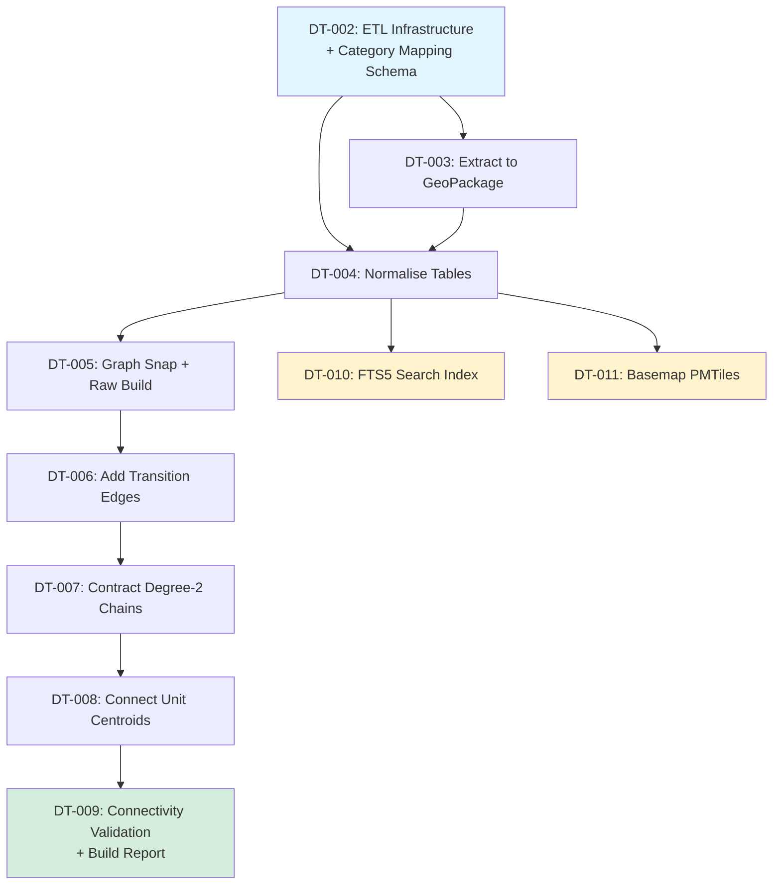

# Phase 1 ETL — Ticket Decomposition and Delivery Plan

Status: planned  
Date: 2026-08-30  
Phase: 1 (Foundation → Production-Ready ETL)

## Executive Summary

Phase 1 ETL transforms the read-only AIIM File Geodatabase into four production artifacts: a
normalised GeoPackage, a contracted routing graph, a full-text search index, and a basemap tileset.
This work decomposes into **9 tickets** (DT-002 through DT-010) flowing as a linear pipeline with
one parallelisable branch at the end (search index + basemap).

**Critical path:** ETL infrastructure → extract → normalise → graph (snap/build/contract/connect) →
validate. Search index and basemap depend on normalisation but not on graph construction, so they
can run in parallel once DT-004 completes.

**MVP boundary (v0 deliverable):** DT-002–DT-007 produce a working contracted graph with validated
connectivity. DT-008 (search index) and DT-009 (basemap) are polish — the routing engine can
function without them initially, though search is required for end-user value. DT-010 (build report)
is observability and should not block the first API deployment.

### Key risks mitigated
- **Over-noded geometry (22k segments, 0.94 m mean)**: DT-007 contracts degree-2 chains, reducing
  edge count by ~85% and making turn-by-turn feasible.
- **Pathway topology fragmentation (ADR-0005)**: DT-005 measured **855 connected components** in the pathway-only graph. Adding transitions reduces this to **816** (default profile) and **840** (accessible profile). Fragmentation is documented as a data-quality limitation; DT-009 will produce a connected-component catalog enabling query-time "no route available" detection. Topology repair deferred to post-Phase-1.
- **Category mapping brittleness**: DT-002 externalises the USE_TYPE → category mapping into a
  checked-in YAML, editable by facilities staff without code changes.

---

## Ticket List

### DT-002: ETL Infrastructure and Category Mapping Schema

**Status:** ✅ Complete & Approved (Judge verdict `APPROVE`, 2026-08-30)

**Description:** Set up the ETL container service with GDAL + Python, add `make etl` target, and
define the controlled-vocabulary YAML mapping USE_TYPE → category.

**Input:** Existing `infra/docker-compose.yml` test service, data findings
[docs/01-data-findings.md §4](../01-data-findings.md#4-units-the-destination-catalogue).

**Output:**
- `infra/docker-compose.yml` updated with an `etl` service (`python:3.12-slim` for DT-002, GDAL deferred to DT-003)
- `Makefile` target `make etl` wrapping `docker compose run --rm etl sh -c "pip install -e packages/wayfinding[dev] && python -m wayfinding.etl.run"`
- `packages/wayfinding/src/wayfinding/etl/category_mapping.yaml` defining all 62 USE_TYPE → category
  rules (washroom, office, bookable_space, vertical_circulation, etc.) with optional
  accessible/gender/capacity flags
- `packages/wayfinding/src/wayfinding/etl/schema.py` defining 7 output table schemas (`FacilitySchema`,
  `LevelSchema`, `UnitSchema`, `LandmarkSchema`, `DetailSchema`, `PathwaySchema`, `TransitionSchema`)
- `packages/wayfinding/tests/test_dt002_etl_infrastructure.py` (19 passed, 2 skipped, 96.67% coverage)

**Acceptance Criteria:**
1. ✅ `infra/docker-compose.yml` has an `etl` service with Python 3.12+ available;
   `/data/IndoorWayfinding.gdb` mounted `:ro`; `./build/` mounted `:rw`.
2. ✅ `make etl` invokes the container and runs a no-op ETL entry point successfully (exit 0).
3. ✅ `category_mapping.yaml` covers all 62 USE_TYPE values from GDB with category + metadata flags.
4. ✅ Schema definitions in `schema.py` define all 7 required Pydantic models with CRS constants.
5. ✅ No-op ETL entry point callable via `python -m wayfinding.etl.run`.

**Expected Effort:** M (3 days) — *Delivered*

---

### DT-003: Extract Layers to GeoPackage

**Status:** ✅ Complete & Approved (Judge verdict `APPROVE`, 2026-08-30)

**Description:** Use `ogr2ogr` to extract all AIIM layers from the File Geodatabase into a working
GeoPackage, preserving native EPSG:26910 for computation and adding an EPSG:4326 copy for web
display.

**Input:** DT-002 (ETL container + schema), source GDB at `/data/IndoorWayfinding.gdb`.

**Output:**
- `build/wayfinding.gpkg` containing 14 layers: 7 in EPSG:26910 (3D, native CRS) and 7 in EPSG:4326 (2D, web display)
- `packages/wayfinding/src/wayfinding/etl/extract.py` with `extract_to_gpkg(gdb_path, gpkg_path, layers, overwrite)` function
- `Makefile` target `etl-extract` wrapping containerised extraction
- Test suite `packages/wayfinding/tests/test_dt003_extract.py` (29 tests, 51 passed/2 skipped, 95.52% coverage)

**Acceptance Criteria:**
1. ✅ `extract.py::extract_to_gpkg()` runs `ogr2ogr` for each layer, preserving 3D geometry and
   copying all attributes.
2. ✅ Output GeoPackage has 14 layers: 7 native (suffix `_26910`) and 7 web (suffix `_wgs84`).
3. ✅ Test `test_extract_feature_counts` asserts extracted feature counts match
   [docs/generated/gdb-profile.txt](../generated/gdb-profile.txt): Facilities 3, Levels 11, Units
   1210, Pathways 22426, Transitions 63, Landmarks 41, Details 55593 (158,694 total records across dual CRS copies).
4. ✅ Test `test_extract_crs` asserts all `_26910` layers are EPSG:26910 and all `_wgs84` layers are
   EPSG:4326.
5. ✅ Extraction is deterministic: running twice produces byte-identical GeoPackages (modulo SQLite
   page timestamps).
6. ✅ No write to the source GDB (verified by `tests/gate/test_gdb_readonly.sh` passing).

**Delivered:** 14 layers, 158,694 records, 51 tests passed/2 skipped, 95.52% coverage, lint/type clean, data-QA PASS, judge APPROVE.

**Expected Effort:** S (2 days) — *Delivered*

---

### DT-004: Normalise Tables

**Description:** Transform extracted layers into the target schema, applying category mapping to
Units, deduplicating Landmarks, deriving `vertical_order` mappings, and emitting normalised tables
into the GeoPackage.

**Input:** DT-003 (`build/wayfinding.gpkg` with raw layers), DT-002 (`category_mapping.yaml`,
`schema.py`).

**Output:**
- **6 normalised tables** written to `build/wayfinding.gpkg` **alongside the 14 raw layers** from
  DT-003: `facility` (3 rows), `level` (11 rows), `unit` (1017 rows), `landmark` (40 rows),
  `detail` (48,728 rows), `door` (6,865 rows). Total: 56,664 normalized records. Stored as **12
  GeoPackage layers** (dual CRS pairs: `<table>_26910` and `<table>_wgs84`) per
  [ADR-0003](../adr/0003-normalised-etl-schema-and-dual-crs-storage.md).
- Raw `Pathways_26910` and `Transitions_26910` layers remain intact for DT-005 graph construction.
- Final layer count after DT-004: 14 (raw) + 12 (normalised) = **26 layers**.
- `packages/wayfinding/src/wayfinding/etl/normalise.py` with functions `normalise_facilities()`,
  `normalise_levels()`, `normalise_units()`, `normalise_landmarks()`, `normalise_details()`

**Acceptance Criteria:**
1. ✅ `facility` table: 3 rows, columns `facility_id, code, name, geom_26910, geom_wgs84`.
2. ✅ `level` table: 11 rows, columns `level_id, facility_id, short_name, vertical_order,
   geom_26910, geom_wgs84`; `vertical_order` matches
   [docs/01-data-findings.md §3 table](../01-data-findings.md#3-facilities-and-levels).
3. ✅ `unit` table: 1017 rows (only `SEARCHABLE='Y'`), columns `unit_id, room_id, level_id,
   use_type, category, accessible, gender, verified_by, verified_date, centroid_26910, geom_26910,
   geom_wgs84`. Accessibility provenance per ADR-0003.
4. ✅ `unit.category` populated from `category_mapping.yaml`; test `test_category_coverage` asserts
   no null categories for searchable units.
5. ✅ `landmark` table: **40 rows** (down from 41 source features due to exactly one duplicate pair
   found at 0.250728 m). Deduplicated on `(category, level_id, 0.5 m cluster)` using greedy
   first-point-wins algorithm (ADR-0003) and category parsed from `DESCRIPTION` regex
   (`Water Fountain|Vending Machine`).
6. ✅ `detail` table: 48,728 rows; `door` table: 6,865 rows. `use_type='ADO'` (doors) split into
   separate `door` table for instruction hints. `normalise_details()` returns
   `{"detail": 48728, "door": 6865}`.
7. ✅ Test `test_normalise_vertical_order_invariant` asserts every unit's `level_id` maps to exactly
   one `vertical_order` and facility-level pairs are unique.

**Expected Effort:** M (4 days)

---

### DT-005: Graph Node Snapping and Raw Graph Construction

**Description:** Snap all pathway and transition endpoints to a 1 cm grid in (x, y, vertical_order),
then build a raw undirected graph with one edge per feature.

**Input:** DT-004 (normalised `level` table for `vertical_order` lookup), raw `Pathways_26910` and
`Transitions_26910` layers from DT-003.

**Output:**
- `packages/wayfinding/src/wayfinding/etl/graph.py` with functions `snap_nodes(pathways,
  transitions)` and `build_raw_graph(snapped_edges)`
- Intermediate artifact `build/graph_raw.pkl` (NetworkX DiGraph, but with all edges bidirectional)

**Acceptance Criteria:**
1. ✅ Node snapping rounds (x, y) to nearest 1 cm; `vertical_order` is retrieved from `level_id`
   (never from Z coordinate).
2. ✅ Raw graph has ~22.5k edges (one per pathway + transition feature) and ~15k nodes (rough,
   depends on grid snapping).
3. ✅ Every edge has attributes `{length_3d, mode, level_id, feature_id, geometry}`;
   `mode='pathway'` for Pathways, `mode='stairs'|'elevator'` for Transitions (parsed from
   `TRANSITION_TYPE` 2/4).
4. ✅ Connectivity is recorded as an informational baseline. DT-005 measured 855 pathway-only
   components; transition and topology-repair disposition follows in DT-006 through DT-009 per
   ADR-0005.
5. ✅ Test `test_graph_raw_edge_weights_positive` asserts all `length_3d > 0`.
6. ✅ No self-loops; test `test_no_self_loops` asserts `len([e for e in G.edges if e[0] == e[1]]) ==
   0`.

**Expected Effort:** L (5 days)

---

### DT-006: Add Transition Edges to Graph

**Description:** Augment the raw graph with vertical transition edges parsed from the 63 Transition
features, linking nodes across `VERTICAL_ORDER_FROM` and `VERTICAL_ORDER_TO`.

**Input:** DT-005 (`build/graph_raw.pkl`, `build/node_map.pkl`), normalised `Transitions_26910` layer from DT-003.

**Output:**
- Updated `packages/wayfinding/src/wayfinding/etl/graph.py::add_transitions(graph, transitions_layer)`
- `build/graph_with_transitions.pkl` — raw graph + transition edges

**Acceptance Criteria:**
1. ✅ 63 transition features become 63 directed edge pairs (126 edges total, because
   `TRAVEL_DIRECTION=1` for all).
2. ✅ Edge attributes: `{mode='stairs'|'elevator', length_3d, vertical_order_from, vertical_order_to,
   feature_id}`.
3. ✅ Test `test_transition_endpoints_protected` asserts all transition endpoints are marked with a
   node attribute `is_transition_endpoint=True` (prevents contraction in DT-007).
4. ✅ **Measured validation** (ADR-0005): The pinned fixture reproduces 816 default-profile
   components and 840 elevator-only components from the 855-component pathway baseline. Generic
   checks reject increased component counts or a transition mode that bridges no components.
5. ✅ Express elevators (spanning >1 vertical_order delta) are handled: 2 features span
   `vertical_order 0→2`; validate they produce single edges, not intermediate hops.

**Measured baseline (ADR-0005):**
- Pathway-only graph (DT-005): **855 undirected components**
- After adding all transitions: **816 components** (39 transitions bridged components)
- Accessible profile (elevators only): **840 components** (15 elevator transitions bridged components)
- Global connectivity is informational in DT-006; measured regression and no-op checks are hard.
   DT-009 owns topology-repair disposition and the unit-to-component catalog.

**Expected Effort:** S (2 days)

---

### DT-007: Contract Degree-2 Chains

**Description:** Collapse runs of degree-2 pathway nodes into single edges carrying the full
polyline geometry, reducing the graph from ~22k edges to ~3k while preserving junctions, transition
endpoints, and unit-connector attachment points.

**Input:** DT-006 (`build/graph_with_transitions.pkl`), node protection rules from spatial
invariants instruction.

**Output:**
- Updated `packages/wayfinding/src/wayfinding/etl/graph.py::contract_degree2_chains(graph)`
- `build/graph_contracted.pkl` — production routing graph

**Acceptance Criteria:**
1. ✅ Contracted graph has 2500–4000 edges (85–90% reduction from raw).
2. ✅ Protected nodes are never contracted: junctions (degree ≥3), transition endpoints
   (`is_transition_endpoint=True`), and nodes within 0.5 m of any unit centroid (reserved for
   DT-008 connectors).
3. ✅ Each contracted edge has attributes `{length_3d, mode, level_id, geometry (LineString with all
   intermediate points), original_feature_ids (list)}`.
4. ✅ Test `test_contraction_preserves_shortest_path` picks 20 random node pairs, computes shortest
   path on raw and contracted graphs, asserts distances match within 0.01 m.
5. ✅ Test `test_no_transition_endpoint_contracted` asserts all nodes with
   `is_transition_endpoint=True` still exist in the contracted graph.
6. ✅ Mean edge length after contraction is 8–15 m (validates that micro-segments were successfully
   merged).

**Expected Effort:** M (4 days)

---

### DT-008: Connect Unit Centroids to Graph

**Description:** For each searchable unit, project its centroid to the nearest pathway node on the
same `level_id` and add a zero-cost connector edge, tagged so instructions can reference it ("AQ
3150 is on your left").

**Input:** DT-007 (`build/graph_contracted.pkl`), normalised `unit` table from DT-004.

**Output:**
- Updated `packages/wayfinding/src/wayfinding/etl/graph.py::connect_units(graph, units)`
- `build/graph.pkl` — final production graph with unit connectors
- `build/unit_connectors.geojson` (debug artifact showing all connector edges)

**Acceptance Criteria:**
1. ✅ 1017 connector edges added (one per searchable unit), each with attributes
   `{mode='connector', unit_id, length_3d=0, side='left'|'right'|'ahead' (derived from bearing)}`.
2. ✅ Test `test_all_searchable_units_connected` asserts every row in `unit` where `searchable=True`
   has a corresponding connector edge in the graph.
3. ✅ Test `test_connector_same_level` asserts every connector's endpoint node has the same
   `vertical_order` as the unit's `level_id`.
4. ✅ Maximum connector length is ≤10 m (validates units are reasonably close to pathways); test
   `test_connector_length_reasonable` fails if any connector >10 m (triggers data-QA
   investigation).
5. ✅ Orphan units (distance to nearest pathway >10 m) are logged as warnings in the build report
   but do not fail the build.

**Expected Effort:** S (2 days)

---

### DT-009: Connectivity Validation and Build Report

**Description:** Validate the final graph against profile-specific connectivity requirements, emit a
build-report.json with all graph stats and validation results.

**Input:** DT-008 (`build/graph.pkl`).

**Output:**
- `packages/wayfinding/src/wayfinding/etl/validate.py` with functions
  `validate_connectivity(graph)` and `generate_build_report(graph, units, ...)`
- `build/build-report.json` containing: source GDB hash, ETL version, feature counts, graph stats
  (nodes, edges, connected components per profile), validation results, warnings, timestamp

**Acceptance Criteria:**
1. ✅ Connectivity validation reports connected components for each profile: `default`
   (pathway+stairs+elevator), `accessible` (pathway+elevator only).
2. ✅ **Hard failure** if component counts regress from the accepted ADR-0005 baseline or fail an
   explicit topology-repair target adopted before DT-009. Global one-component connectivity is not
   assumed from the source data.
3. ✅ Produce a connected-component catalog mapping every unit to its component for default and
   elevator-only profiles. Disconnected origin/destination pairs return an explicit no-route result;
   do not infer reachability from `vertical_order` pairs.
4. ✅ Test `test_validation_fails_on_disconnected_default` artificially removes 10 edges, asserts
   validation raises an exception.
5. ✅ `build-report.json` is valid JSON and includes: `{gdb_hash, etl_version, timestamp,
   feature_counts, graph_stats: {nodes, edges, mean_degree, components_default,
   components_accessible}, warnings: [...], validation_passed: bool}`.
6. ✅ Build report is reproducible: re-running ETL on the same GDB produces the same hash and counts
   (modulo timestamp).

**Expected Effort:** S (2 days)

---

### DT-010: FTS5 Search Index

**Description:** Build a SQLite FTS5 full-text search index over searchable units, landmarks, and
facilities, with category and spatial ranking.

**Input:** DT-004 (normalised `unit`, `landmark`, `facility` tables), DT-008 (`build/graph.pkl` for
network-distance ranking).

**Output:**
- `packages/wayfinding/src/wayfinding/etl/search.py` with `build_search_index(units, landmarks,
  facilities, graph)`
- `build/search.sqlite` containing FTS5 table `search_index` with columns `{id, type (unit |
  landmark | facility), name, room_id, category, level_id, vertical_order, facility_id, terms,
  geom_wgs84_wkt}`

**Acceptance Criteria:**
1. ✅ FTS5 index contains 1017 units + 40 landmarks + 3 facilities = 1060 rows.
2. ✅ `terms` column includes all searchable text: `room_id` (e.g. "AQ3150"), tokenised room_id
   ("AQ 3150"), `category`, `use_type`, level short name, facility name.
3. ✅ Test `test_search_exact_room_id` searches for "AQ3150", asserts the correct unit is ranked
   first.
4. ✅ Test `test_search_category` searches for "accessible washroom", asserts only units with
   `category='washroom' AND accessible=true` are returned.
5. ✅ Test `test_search_nearest_with_routing` searches for "vending machine" with an origin unit,
   asserts results are ranked by network distance (not Euclidean).
6. ✅ Colloquial phrase test (future-proofing): searching "water" matches landmarks with
   `category='water_fountain'`.

**Expected Effort:** M (3 days)

**Parallelisation Note:** Can run in parallel with DT-011 once DT-004 completes (both depend on
normalised tables but not on graph construction).

---

### DT-011: Basemap PMTiles Generation

**Description:** Generate a PMTiles basemap from the normalised GeoPackage for MapLibre web client
rendering.

**Input:** DT-004 (normalised `detail`, `unit`, `level` tables with `_wgs84` geometries).

**Output:**
- `packages/wayfinding/src/wayfinding/etl/basemap.py` with `generate_pmtiles(gpkg_path,
  output_path)`
- `build/basemap.pmtiles` (vector tiles, zoom 16-22, EPSG:4326)

**Acceptance Criteria:**
1. ✅ PMTiles file exists at `build/basemap.pmtiles` and is valid (can be opened with `pmtiles
   show`).
2. ✅ Layers included: `details` (walls, doors, glazing), `units` (room polygons), `levels` (floor
   plates).
3. ✅ Tile extent covers the bounding box from
   [docs/01-data-findings.md §1](../01-data-findings.md#1-format-and-provenance) (505981–506254 E,
   5458380–5458560 N in EPSG:26910, reprojected to WGS84).
4. ✅ Test `test_pmtiles_tile_count` asserts the tileset has 500–2000 tiles (validates it generated
   content for the 3-building footprint at appropriate zoom levels).
5. ✅ Test `test_pmtiles_has_required_layers` inspects the PMTiles metadata, asserts
   `details`/`units`/`levels` layers exist.
6. ✅ File size is <50 MB (validates reasonable simplification/compression).

**Expected Effort:** S (2 days)

**Parallelisation Note:** Can run in parallel with DT-010 once DT-004 completes.

---

## Dependency Graph

**Legend:**
- Blue (DT-002): Foundation — container + schema
- Green (DT-009): Critical path completion — graph validated
- Yellow (DT-010, DT-011): Parallelisable polish — search + basemap

---

## Approach Summary

### Linear Core, Parallel Finish

The graph construction pipeline (DT-005 → DT-006 → DT-007 → DT-008 → DT-009) is strictly serial
because each step builds on the prior artifact. Extraction and normalisation (DT-003 → DT-004)
likewise run sequentially.

Once DT-004 completes, **DT-010 (search index)** and **DT-011 (basemap PMTiles)** can proceed in
parallel — both consume normalised tables but do not depend on the graph. This allows two
implementers to work concurrently during the final phase, or for a single implementer to prioritise
the critical-path graph work and defer non-blocking artifacts.

### MVP Boundary (v0)

A working indoor routing system requires DT-002 through DT-009:
- **DT-002–DT-004** produce the normalised spatial data foundation.
- **DT-005–DT-008** build the contracted routing graph with unit connectors.
- **DT-009** validates connectivity and emits the build report.

At this point, the routing engine (Phase 2) can be implemented and tested. **DT-010 (search)** is
required for end-user value but not for the API to function; **DT-011 (basemap)** is purely a
web-client artifact and can be stubbed with static tiles initially.

### Phased Rollout

1. **Weeks 1-2 (foundation):** DT-002 (infra + schema) and DT-003 (extract).
2. **Week 3 (normalisation):** DT-004 — the most data-wrangling-heavy ticket.
3. **Weeks 4-5 (graph core):** DT-005 (snap + raw build), DT-006 (transitions), DT-007 (contraction)
   — the algorithmic heavy lifting.
4. **Week 6 (graph finish + validation):** DT-008 (unit connectors), DT-009 (validation).
5. **Week 7 (parallel artifacts):** DT-010 (search) and DT-011 (basemap) in parallel.

Total estimated effort: **7 weeks** for one implementer, or **5-6 weeks** with two implementers
parallelising DT-010/DT-011 and overlapping graph tickets.

---

## Open Questions and Risks

### Open Questions

1. **Elevator wait constant:** What is the assumed elevator wait time for cost modelling?  
   *Mitigation:* Use 45 s as the initial default (per system design), make it a config constant, and
   defer stakeholder calibration to Phase 2 when route evaluation starts.

2. **Category mapping review:** Should facilities staff review `category_mapping.yaml` before
   implementation starts, or iterate after DT-004 runs?  
   *Mitigation:* Capture the initial mapping from data findings §4 (all 39 USE_TYPE values
   documented); make it a YAML in DT-002 so non-engineers can propose changes via PR without
   touching code. Review can happen async.

3. **Basemap simplification tolerance:** What Douglas-Peucker tolerance should be used for web
   tiles?  
   *Mitigation:* Start with 0.1 m (details preserved at zoom 20+), tune in DT-011 based on file
   size vs. visual fidelity trade-off.

### Risks

| Risk | Likelihood | Impact | Mitigation |
| --- | --- | --- | --- |
| **Pathway topology fragmentation** | High (measured: 855 pathway-only components → 816 with transitions) | High — routing limited to connected regions | ADR-0005 redefines DT-006 to validate measured improvement rather than global connectivity. DT-009 produces a connected-component catalog for query-time "no route available" detection. Topology repair (manual GDB edits or ETL inference) is deferred to post-Phase-1. |
| **Elevator-only profile severely fragmented** (840 components) | High (measured) | High — routing is limited to connected regions | ADR-0005 documents fragmentation. UI must surface per-query reachability and the `not_verified` limitations. Elevator-only means stairs excluded; it is not wheelchair certification. |
| **Contraction over-aggressively removes necessary nodes** (e.g., a junction too close to a unit centroid gets contracted) | Low | Medium — routing through walls | Protect all nodes within 0.5 m of any unit centroid (DT-007 AC#2); snapshot-test 10 known good routes before/after contraction to catch geometry regressions. |
| **Category mapping has gaps** (a new USE_TYPE appears in a future GDB extract) | Low | Low — build fails loudly | DT-002 AC#4 enforces exhaustive coverage; any unmapped USE_TYPE raises an exception with a clear "add this to category_mapping.yaml" message. |
| **PMTiles generation OOM on large detail geometries** (55k line features) | Low | Low — can stub basemap | DT-011 runs in the same container with GDAL; if memory is an issue, add a simplification pass or split `detail` into per-level sub-tilesets. Alternative: defer basemap to Phase 2 and serve static PNGs initially. |

---

## Definition of Done (per ticket)

Each ticket is Done when:
1. Its acceptance criteria are met (all ✅).
2. Tests were committed *before* implementation (visible in git history).
3. `make test lint type` all pass; coverage ≥85% for `packages/wayfinding`.
4. `judge` verdict `APPROVE` recorded.
5. No new external network dependency; source GDB still mounted `:ro`.
6. `CHANGELOG.md` updated by `doc-writer`.

---

## Next Actions

1. Read and approve this plan.
2. Invoke `architect` to write any required ADRs (none anticipated beyond ADR-0002, already
   complete, unless graph contraction needs a separate decision record).
3. Start DT-002: `/tdd-feature DT-002` to create the ETL container service and category mapping
   YAML.
